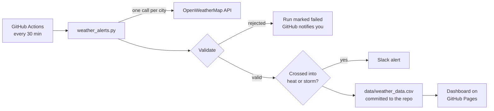

# Weather-Data-Collection-Data-Pipeline
Fully automated data pipeline to collect, validate, store, and visualize near-real-time weather data, with alerts for extreme conditions

This project collects the current weather for a set of cities every 30 minutes using **Python** and **GitHub Actions**. Each reading is validated and stored in a versioned CSV file in this repository, **Slack alerts** go out when a city crosses into heat or storm conditions, and a live **dashboard** on GitHub Pages shows trends, a heatmap, and alert history.

> The first version of this project ran as a Databricks notebook using PySpark and Delta Lake. It moved to GitHub Actions so it can run on a schedule around the clock, for free, without keeping a cluster running.

---

## 📌 Project Objectives

- 🔁 **Automate** the collection of weather data from a public API, every 30 minutes
- 🧹 **Clean**, structure, and validate every reading before it is stored
- 🏪 **Store** the full history in a CSV that is committed to the repository on every run
- 📊 **Visualize** trends on a dashboard: temperature over time, an hour-of-day heatmap, ranges per city
- 🚨 **Trigger alerts** for adverse conditions: heat above a set limit, and storms (thunderstorms, heavy rain or snow, squalls, tornadoes, gale-force wind)

---

## 🌍 Dataset Source

- **API**: [OpenWeatherMap Current Weather API](https://openweathermap.org/current)
- **Collected Fields**:

| Column | Meaning |
|---|---|
| `city` | City name as returned by the API |
| `temperature` | Temperature in Kelvin |
| `description` | Weather description (e.g. clear sky, light rain) |
| `timestamp` | When the reading was taken, in UTC (ISO 8601) |
| `condition_id` | OpenWeatherMap [weather condition code](https://openweathermap.org/weather-conditions), used for storm alerts |
| `wind_speed` | Wind speed in metres per second (blank if the API did not report it) |

Data is collected **every 30 minutes** by a scheduled GitHub Actions workflow and stored in `data/weather_data.csv`.

---

## 🔧 Technologies Used

| Tool | Purpose |
|---|---|
| Python 3 (standard library only) | API calls, validation, alert logic, storage |
| OpenWeatherMap API | Source of the weather data |
| GitHub Actions | Runs the pipeline on a schedule and reports failed runs |
| CSV in Git | Storage; the commit history doubles as an audit trail of every run |
| GitHub Pages, HTML, SVG, JavaScript | Live dashboard, with no build step or libraries |
| Slack incoming webhook | Delivers alerts |

---

## 🔁 Pipeline Architecture



### 1. **Data Collection**
- The workflow (`.github/workflows/weather.yml`) runs `weather_alerts.py` at 7 and 37 minutes past every hour (UTC); it can also be run by hand from the Actions tab
- The script makes one API request per city in `CITIES`

### 2. **Validation and Cleaning**
- Only the six fields above are kept; everything else in the API response is dropped
- Incomplete responses (no city, temperature or conditions) are rejected rather than stored with blanks
- Implausible values are rejected: temperatures outside 180–340 K (about −93 °C to 67 °C) and wind speeds outside 0–120 m/s
- If two entries in `CITIES` resolve to the same place, it is stored only once per run
- The schema is fixed: columns are always written in the same order, and when new columns are added, an older file is upgraded in place (old rows get blanks in the new columns)

### 3. **Error Handling and Monitoring**
- Requests that hit a rate limit (429), a temporary server error (500, 502, 503, 504) or a network error are tried up to 3 times, with a growing delay between attempts
- Each run's log in the Actions tab shows every step: readings loaded, each city's reading, alerts sent, readings rejected and rows stored
- Any rejected reading or unsent alert marks the run as failed, which triggers GitHub's failed-run notification
- If an alert cannot be sent, that reading is held back so the next run sees the change again and retries the alert
- The API key and webhook address are stored as GitHub secrets and never printed in logs
- The dashboard shows a warning when no new reading has arrived for 90 minutes

### 4. **Storage**
- New readings are appended to `data/weather_data.csv` and committed by the workflow, so every run is a commit in the repository history

### 5. **Visualization**
The dashboard (`index.html`, served by GitHub Pages) reads the CSV straight from the repository and checks for new readings every 5 minutes. It shows:
- Headline numbers: readings collected, hottest and coldest city right now, and alerts in the selected period
- Temperature over time for each city, with the alert limit marked
- Recent alerts (heat and storm), worked out with the same rules the pipeline uses
- A heatmap of average temperature by city and hour of day
- Each city's temperature range (low, average, high)
- The latest reading per city, with wind, flags for cities above the limit or in a storm, and a count of readings per city

A time-range filter (24 hours, 7 days, 30 days, all) applies to everything on the page. It works on phones and follows the system's light or dark mode.

### 6. **Alerts**
- **Heat**: the temperature rises above `TEMP_LIMIT_C` (default 30 °C)
- **Storm**: a thunderstorm, heavy or freezing rain, heavy snow, squall or tornado is reported, or wind reaches `WIND_LIMIT_MS` (default 17.2 m/s, a gale on the Beaufort scale)
- Alerts fire when a city *crosses into* a condition, not on every reading while it lasts, so a hot afternoon produces one message rather than one every 30 minutes
- Heat and storm alerts for the same city in the same run are combined into one message

---

## ⚙️ Setup

1. **Secrets**: in Settings → Secrets and variables → Actions, add `OWM_API_KEY` (your OpenWeatherMap key) and `ALERT_WEBHOOK` (a Slack incoming webhook URL). Without the webhook, alerts only appear in the run log.
2. **Settings**: edit `CITIES` and `TEMP_LIMIT_C` in `.github/workflows/weather.yml`. To change the wind limit, add `WIND_LIMIT_MS` there too. Keep `ALERT_LIMIT_C` and `WIND_LIMIT_MS` near the top of the script in `index.html` the same, so the dashboard matches the alerts.
3. **Dashboard**: in Settings → Pages, deploy from the `main` branch, `/ (root)` folder.
4. **First run**: in the Actions tab, open *Weather alerts* and click *Run workflow*.

## 📁 Repository Layout

```
.github/workflows/weather.yml   schedule and workflow steps
weather_alerts.py               collection, validation, alerts, storage
index.html                      dashboard
data/weather_data.csv           collected readings (created by the first run)
```

---

## 📈 What the Dashboard Lets You Check

- How much each city's temperature swings over a day, and at what hours it peaks (heatmap)
- Which cities spend the most time above the alert limit, and how often they cross it (alert history)
- How often storms or gale-force winds occur in each city
- Whether the pipeline is healthy: steady reading counts per city and no staleness warning

## ✅ Results

- The pipeline runs unattended every 30 minutes on GitHub's free tier, with no server or cluster to maintain
- Alerts reach Slack in the first run after a city crosses a limit, usually within 30 minutes (GitHub can delay scheduled runs at busy times)
- Every reading is validated before storage, and the full history is kept and versioned
- The dashboard updates itself as new data is committed

## ⚠️ Limitations

- Readings are 30 minutes apart, so short events between runs can be missed
- GitHub may delay or occasionally skip scheduled runs when its servers are busy
- The CSV grows by one row per city per run; for a handful of cities this stays small for years, but a much larger city list would be better served by a database
